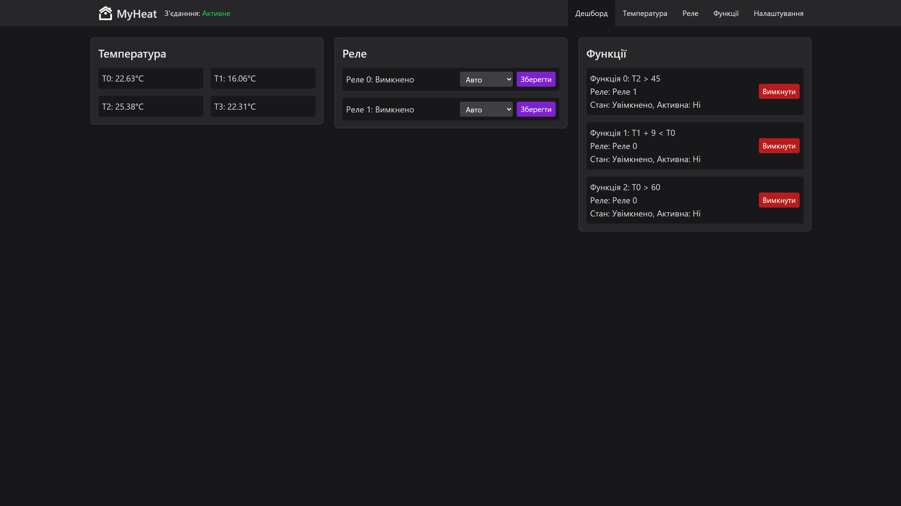
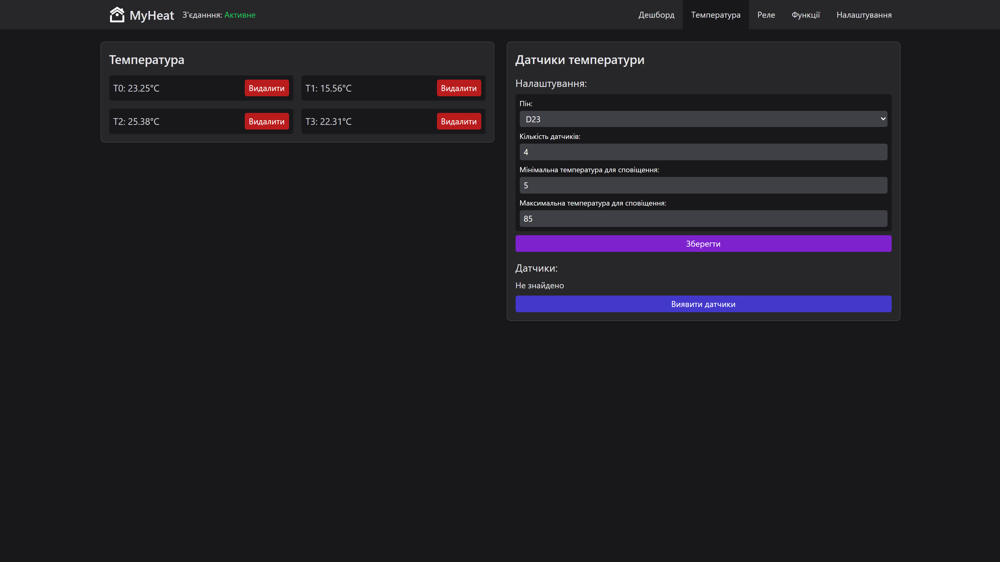
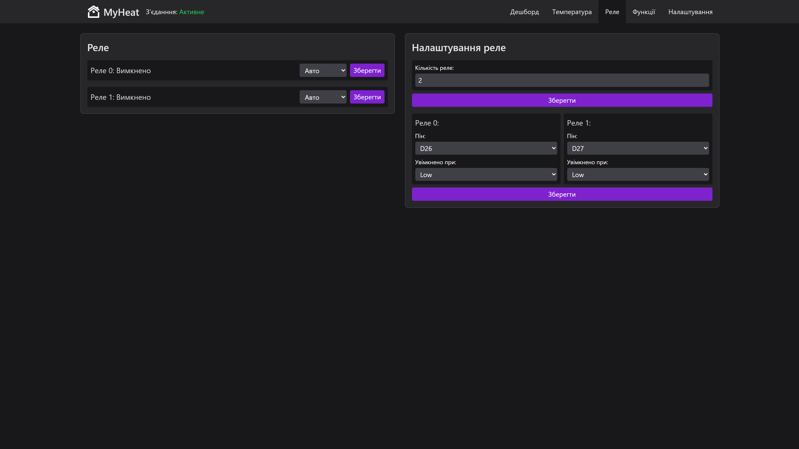
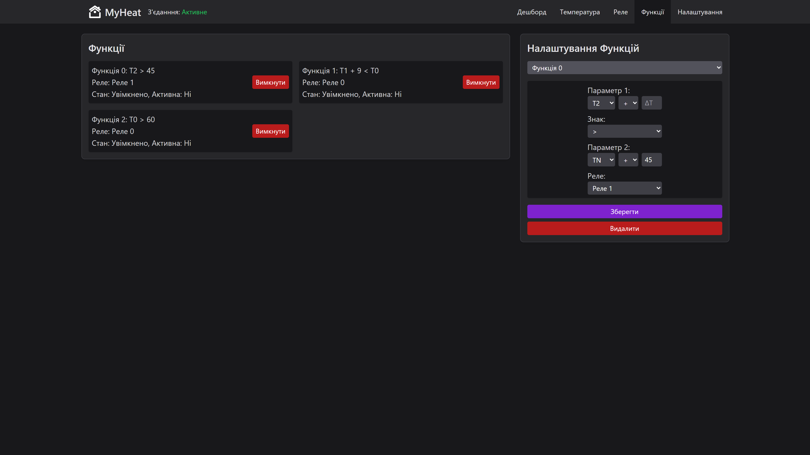
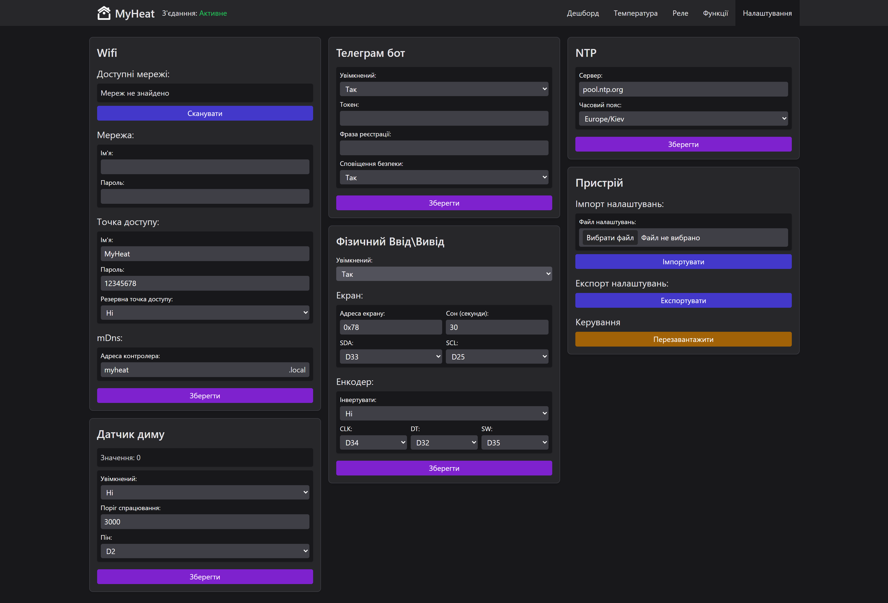

# 🔥 MyHeat — Smart IoT Heating Control System

<p align="center">
  
  
  
  
  
</p>

<p align="center">
  <b>A high-performance, real-time IoT heating control system built for ESP32 microcontrollers with modern React web interface and Telegram bot integration.</b>
</p>

---

## 📱 Screenshots

### Dashboard View

<!-- TODO: Add screenshot -->

_Real-time overview of temperatures, relay states, and system status at a glance_

### Temperature Monitoring

<!-- TODO: Add screenshot -->

_Detailed multi-sensor temperature readings with live updates and configurable thresholds_

### Relay Control Panel

<!-- TODO: Add screenshot -->

_Manual and automated relay control with visual status indicators_

### Custom Automation Functions

<!-- TODO: Add screenshot -->

_Programmable automation rules with delta-based temperature logic_

### System Settings

<!-- TODO: Add screenshot -->

_Comprehensive configuration panel for WiFi, Telegram, NTP, hardware I/O, and more_

---

## 🎯 Project Overview

**MyHeat** is a comprehensive IoT-based home heating control system designed for **smart home automation**. Built from the ground up with a focus on **speed, reliability, and low resource consumption**, it provides real-time monitoring and control of heating systems through multiple interfaces.

### Why MyHeat?

- 🏠 **Complete Heating Solution** — Monitor temperatures, control relays, and automate heating logic
- 📱 **Multi-Platform Access** — Web dashboard, Telegram bot, and local OLED display
- ⚡ **Optimized for IoT** — Minimal memory footprint, non-blocking architecture, fast response times
- 🛡️ **Safety First** — Smoke detection, temperature alerts, and fail-safe mechanisms
- 🔧 **Highly Configurable** — All parameters adjustable via web interface without reflashing

---

## ✨ Core Features

### 🌡️ Advanced Multi-Sensor Temperature Monitoring

- **Up to N DS18B20 sensors** with dynamic sensor count configuration
- **OneWire protocol** for efficient multi-sensor communication on a single pin
- **11-bit resolution** temperature readings for precision measurements
- **Automatic sensor discovery** — scan and assign sensors without manual address entry
- **Real-time alerts** for min/max threshold violations and connection failures
- **Configurable temperature ranges** with persistent storage

### 🔌 Intelligent Multi-Relay Control

- **Multiple relay outputs** with configurable pin assignments
- **Three operating modes**: Off, On, and Auto (controlled by custom functions)
- **Active-high/Active-low trigger support** for different relay modules
- **Real-time status feedback** with WebSocket updates
- **Per-relay configuration** stored persistently in LittleFS

### 🤖 Custom Automation Functions

The heart of MyHeat's automation — a **programmable rule engine** that enables sophisticated heating control:

```
IF (T[sensor1] + delta1) [>/<] (T[sensor2] + delta2) THEN Relay[n] = ON/OFF
```

- **Delta-based temperature comparison** between any two sensors
- **Configurable comparison operators** (greater than / less than)
- **Per-function enable/disable toggle** for easy testing
- **Validation system** ensuring sensor and relay indices are valid
- **Alert notifications** for misconfigured functions

### 🚨 Safety & Alert System

- **MQ-2 Smoke/Gas Sensor Integration**
  - Configurable detection threshold
  - Automatic preheat period handling (30s default)
  - Bad connection detection
- **Multi-channel alert notifications**
  - Real-time WebSocket alerts to web dashboard
  - Telegram bot push notifications
- **Temperature alert types**
  - Minimum threshold breach
  - Maximum threshold breach
  - Sensor connection failure

### 🌐 Modern React Web Interface

The web dashboard is a **production-ready single-page application** delivering a premium monitoring experience:

#### Frontend Stack & Architecture

- **React 19** with experimental React Compiler support (beta) for automatic memoization
- **Vite 6.2** — lightning-fast HMR during development, optimized production builds
- **Tailwind CSS 3.4** with custom Zinc gray palette for a sleek dark theme
- **Zustand 5** — minimal, hook-based state management with selector subscriptions
- **Path aliases** (`@/`) for clean imports across the project

#### Real-Time Communication

- **WebSocket-first architecture** — bi-directional communication with ESP32
- **react-use-websocket** hook with automatic reconnection (3 attempts, 1s interval)
- **Inactivity detection** — monitors connection health with 8-second timeout
- **Environment-aware endpoints** — auto-switches between dev proxy and production
- **JSON message protocol** with typed message handlers

#### UI Components & Design

- **Custom component library**: Button, Input, Select, SelectToggle, FormField, FileUpload
- **WiFi signal strength indicator** with visual RSSI levels
- **react-toastify** for success/warning/error notifications
- **react-icons** for consistent iconography
- **Responsive layout** — mobile-first design with Tailwind breakpoints
- **Dark theme UI** optimized for 24/7 monitoring dashboards

#### State Management Pattern

```
┌─────────────────────────────────────────────────────────────┐
│                    Zustand Stores                           │
├──────────────┬──────────────┬───────────────┬──────────────┤
│ websocket    │ temperature  │ relay         │ function     │
│ Store        │ Store        │ Store         │ Store        │
├──────────────┼──────────────┼───────────────┼──────────────┤
│ • connection │ • readings   │ • states      │ • rules      │
│ • messages   │ • settings   │ • modes       │ • enabled    │
│ • sendMsg()  │ • thresholds │ • pins        │ • validation │
└──────────────┴──────────────┴───────────────┴──────────────┘
           │                            │
           ▼                            ▼
┌─────────────────────────────────────────────────────────────┐
│              WebSocketContainer (Provider)                  │
│  • Manages connection lifecycle                             │
│  • Routes incoming messages to stores                      │
│  • Provides sendJsonMessage to components                  │
└─────────────────────────────────────────────────────────────┘
```

#### Production Optimizations

- **Gzip compression** via `vite-plugin-compression` — assets compressed to ~50KB
- **Source file deletion** — only `.gz` files deployed to LittleFS
- **Direct build output** to ESP32 `/data` directory
- **Tree-shaking** and code splitting for minimal bundle size
- **6-month cache headers** for static assets served by ESP32

### 📱 Telegram Bot Integration (FastBot2)

- **Remote control** of all device functions via Telegram commands
- **Real-time push notifications** for alerts and status changes
- **User registration system** with secure phrase authentication
- **Menu-driven interface** for intuitive mobile control
- **Multi-user support** with persistent user data

### 📶 Robust WiFi Connectivity

- **Station mode** for home network connection
- **Access Point fallback** — auto-creates hotspot if WiFi fails
- **Configurable fallback behavior**:
  - AP fallback timeout (default: 20 seconds)
  - Reconnection interval (default: 10 seconds)
  - Maximum reconnection attempts
- **mDNS service discovery** — access via `http://myheat.local`
- **WiFi network scanning** with RSSI display

### 🖥️ Local OLED Display & Rotary Encoder

- **128x64 SSD1306 OLED display** with Ukrainian language support
- **Rotary encoder navigation** through temperature/relay screens
- **QR code generation** — hold button to display web UI URL as QR
- **Power-save mode** — screen auto-off after configurable timeout
- **WiFi mode toggle** — long press to switch between STA/AP modes

### ⏰ NTP Time Synchronization

- **Automatic time sync** from configurable NTP server
- **Timezone support** with IANA timezone strings (e.g., "Europe/Kiev")
- **Daylight saving offset** configuration
- **Persistent time settings** across reboots

### 💾 Persistent Configuration Storage

- **LittleFS filesystem** for reliable data storage
- **JSON-based configuration files**:
  - `wifi.json` — WiFi and NTP settings
  - `relays.json` — Relay configuration
  - `temperatureSensors.json` — Sensor addresses and thresholds
  - `customFunctions.json` — Automation rules
  - `smokeSensor.json` — Smoke sensor settings
  - `hardwareIO.json` — Display and encoder settings
- **Full device backup/restore** via JSON export/import

---

## 🚀 IoT Optimization Highlights

MyHeat is engineered specifically for **resource-constrained IoT environments**:

| Optimization | Implementation |
|--------------|----------------|
| **Non-blocking architecture** | All sensors and I/O use tick-based polling, no `delay()` calls |
| **Minimal memory footprint** | Dynamic memory allocation, singleton patterns, efficient data structures |
| **Async web server** | ESPAsyncWebServer handles multiple connections without blocking |
| **WebSocket streaming** | Real-time data push instead of HTTP polling (2-second intervals) |
| **Compressed web assets** | Vite + gzip compression for minimal LittleFS usage |
| **Smart reconnection** | Automatic WiFi recovery with configurable fallback AP |
| **Efficient JSON parsing** | ArduinoJson 7 with in-place parsing and serialization |
| **Custom partition table** | Optimized 4MB flash layout with OTA support |

### Flash Partition Layout (4MB)

```
nvs        : 0x5000  (20KB)   — Non-volatile storage
otadata    : 0x2000  (8KB)    — OTA data
app0       : 0x1D0000 (1.8MB) — Primary application
app1       : 0x1D0000 (1.8MB) — OTA update slot
spiffs     : 0x40000 (256KB)  — LittleFS filesystem
coredump   : 0x10000 (64KB)   — Crash dump storage
```

---

## 🛠️ Technical Stack

### Hardware & Firmware

| Component | Version/Spec | Purpose |
|-----------|--------------|---------|
| **ESP32** | NodeMCU-32S | Dual-core 240MHz MCU with WiFi/BT |
| **PlatformIO** | 6.1+ | Build system and dependency management |
| **Arduino Framework** | ESP32 3.0 | Hardware abstraction layer |
| **LittleFS** | Latest | Flash filesystem for configuration |

### Sensors & Actuators

| Component | Interface | Description |
|-----------|-----------|-------------|
| **DS18B20** | OneWire (GPIO 23) | Digital temperature sensors, ±0.5°C accuracy |
| **MQ-2** | Analog (GPIO 35) | Smoke/gas detection sensor |
| **Relay Modules** | GPIO 26, 27 | Optocoupler-isolated relay control |
| **SSD1306 OLED** | I2C (GPIO 25, 33) | 128x64 pixel status display |
| **Rotary Encoder** | GPIO 32, 34, 35 | Navigation and control input |

### Firmware Libraries

| Library | Version | Purpose |
|---------|---------|---------|
| **FastBot2** | ^1.0.12 | High-performance Telegram bot |
| **EncButton** | ^3.6.3 | Encoder and button handling |
| **DallasTemperature** | ^3.11.0 | DS18B20 sensor library |
| **OneWire** | Latest | OneWire protocol implementation |
| **U8g2** | ^2.35.30 | OLED display driver with fonts |
| **ArduinoJson** | ^7.2.0 | JSON parsing and serialization |
| **AsyncTCP** | ESP32Async | Asynchronous TCP client/server |
| **ESPAsyncWebServer** | ESP32Async | Async HTTP and WebSocket server |
| **QRCode** | ^0.0.1 | QR code generation for OLED |

### Web Frontend

| Technology | Version | Purpose |
|------------|---------|---------|
| **React** | 19.0.0 | UI component framework |
| **Vite** | 6.2.0 | Lightning-fast build tool |
| **Tailwind CSS** | 3.4.14 | Utility-first styling |
| **Zustand** | ^5.0.1 | Minimal state management |
| **react-use-websocket** | 4.9.0 | WebSocket hook for React |
| **Luxon** | ^3.5.0 | Modern date/time handling |
| **react-toastify** | ^11.0.3 | Toast notifications |
| **react-icons** | ^5.3.0 | Icon library |

### Development Tools

| Tool | Purpose |
|------|---------|
| **React Compiler (beta)** | Automatic memoization |
| **ESLint** | Code quality and linting |
| **vite-plugin-compression** | Gzip asset compression |
| **PostCSS + Autoprefixer** | CSS processing |

---

## 📁 Project Architecture

```
MyHeat/
├── 📄 platformio.ini                    # PlatformIO configuration
├── 📄 esp32_custom_partition_4mb.csv    # Custom flash partition table
│
├── 📁 src/
│   └── main.cpp                         # Application entry point
│
├── 📁 lib/                              # Modular firmware libraries
│   ├── MyHeatDevice/                    # Core device logic
│   │   ├── MyHeatDevice.h/.cpp          # Main device singleton
│   │   ├── MyHeatTemperatures.h         # Temperature sensor management
│   │   ├── MyHeatRelays.h               # Relay control logic
│   │   ├── MyHeatRelay.h                # Individual relay class
│   │   ├── MyHeatCustomFunctions.h      # Automation engine
│   │   ├── MyHeatCustomFunction.h       # Single function rule
│   │   ├── MyHeatSmokeSensor.h          # Smoke detection
│   │   └── MyHeatAnalogSensor.h         # Analog sensor base class
│   │
│   ├── MyHeatWeb/                       # Web server and API
│   │   ├── MyHeatWeb.h/.cpp             # Main web server
│   │   ├── MyHeatWebTemperatures.*      # Temperature API endpoints
│   │   ├── MyHeatWebRelays.*            # Relay API endpoints
│   │   ├── MyHeatWebCustomFunctions.*   # Functions API endpoints
│   │   ├── MyHeatWebSettings.*          # Settings API endpoints
│   │   └── MyHeatWebUtils.*             # Helper utilities
│   │
│   ├── MyHeatWifi/                      # WiFi connectivity
│   │   └── MyHeatWifi.h                 # STA/AP mode management
│   │
│   ├── MyHeatTelebot/                   # Telegram bot
│   │   ├── MyHeatTelebot.h/.cpp         # Bot core logic
│   │   ├── Menu.h/.cpp                  # Telegram menu system
│   │   ├── Message.h/.cpp               # Message handling
│   │   ├── User.h/.cpp                  # User management
│   │   └── Utils.h/.cpp                 # Bot utilities
│   │
│   ├── MyHeatHardwareIO/                # OLED & encoder
│   │   └── MyHeatHardwareIO.h           # Display and input handling
│   │
│   ├── MyHeatAlerts/                    # Alert system
│   │   └── MyHeatAlerts.h               # Multi-channel notifications
│   │
│   ├── MyHeatSave/                      # Persistence layer
│   │   └── MyHeatSave.h                 # JSON file storage
│   │
│   └── MyHeatUtils/                     # Common utilities
│       └── MyHeatUtils.h                # Helper functions
│
├── 📁 web/                              # React web interface
│   ├── src/
│   │   ├── App.jsx                      # Main application component
│   │   ├── main.jsx                     # React entry point
│   │   ├── index.css                    # Global styles
│   │   ├── components/                  # Reusable UI components
│   │   │   ├── layout/                  # Navigation, layout
│   │   │   ├── ui/                      # Buttons, inputs, cards
│   │   │   ├── Temperatures.jsx         # Temperature display
│   │   │   ├── Relays/                  # Relay components
│   │   │   ├── Functions/               # Function components
│   │   │   ├── CustomToast/             # Toast notifications
│   │   │   └── WebSocketContainer/      # WS connection manager
│   │   ├── pages/                       # Page components
│   │   │   ├── dashboard/               # Dashboard view
│   │   │   ├── temperatures/            # Temperature management
│   │   │   ├── relays/                  # Relay control
│   │   │   ├── functions/               # Automation rules
│   │   │   └── settings/                # System configuration
│   │   ├── store/                       # Zustand state stores
│   │   │   ├── websocketStore.js        # WebSocket connection
│   │   │   ├── temperatureStore.js      # Temperature state
│   │   │   ├── relayStore.js            # Relay state
│   │   │   ├── functionStore.js         # Functions state
│   │   │   ├── settingStore.js          # Settings state
│   │   │   └── pinStore.js              # GPIO pin tracking
│   │   └── utils/                       # Utility functions
│   ├── public/                          # Static assets
│   └── package.json                     # npm dependencies
│
├── 📁 data/                             # LittleFS content (built web UI)
│   └── index.html                       # Production web bundle
│
├── 📁 scripts/
│   └── download_fs.py                   # SPIFFS/LittleFS download script
│
├── 📁 configs/                          # Environment configurations
├── 📁 include/                          # Global header files
└── 📁 test/                             # Unit tests
```

---

## 🚀 Getting Started

### Prerequisites

- **Hardware**:
  - ESP32 development board (NodeMCU-32S recommended)
  - DS18B20 temperature sensor(s)
  - Relay module(s)
  - (Optional) SSD1306 128x64 OLED display
  - (Optional) Rotary encoder with button
  - (Optional) MQ-2 smoke sensor

- **Software**:
  - [PlatformIO Core](https://platformio.org/install/cli) or [PlatformIO IDE](https://platformio.org/install/ide)
  - [Node.js](https://nodejs.org/) 18+ (for web development)
  - Git

### Hardware Wiring

| Component | GPIO Pin | Notes |
|-----------|----------|-------|
| DS18B20 Data | 23 | 4.7kΩ pull-up resistor required |
| Relay 1 | 26 | Active-low by default |
| Relay 2 | 27 | Active-low by default |
| MQ-2 Analog | 35 | Optional smoke sensor |
| OLED SDA | 33 | I2C data line |
| OLED SCL | 25 | I2C clock line |
| Encoder A | 34 | Rotary encoder |
| Encoder B | 32 | Rotary encoder |
| Encoder Button | 35 | Shared with MQ-2 if not used |

### Installation

1. **Clone the repository**
   ```bash
   git clone https://github.com/Tommy4chan/MyHeat.git
   cd MyHeat
   ```

2. **Configure credentials** (copy and edit)
   ```bash
   cp platformio.ini.example platformio.ini
   ```
   
   Edit `platformio.ini` and update:
   ```ini
   -D WIFI_SSID="your_wifi_network"
   -D WIFI_PASSWORD="your_wifi_password"
   -D TELEGRAM_BOT_TOKEN="your_bot_token"
   -D REGISTER_PHRASE="your_secret_phrase"
   ```

3. **Build and upload firmware**
   ```bash
   pio run -t upload
   ```

4. **Upload web interface to LittleFS**
   ```bash
   cd web
   npm install
   npm run build
   cd ..
   pio run -t uploadfs
   ```

5. **Access the web interface**
   - Connect to WiFi: `http://myheat.local`
   - Or via Access Point: Connect to "MyHeat" network, go to `http://192.168.4.1`

### Web Development

```bash
cd web
npm install
npm run dev      # Start dev server with hot reload
npm run build    # Build production bundle
npm run preview  # Preview production build
npm run lint     # Run ESLint
```

---

## ⚙️ Configuration Reference

### Build Flags (platformio.ini)

| Flag | Default | Description |
|------|---------|-------------|
| `WIFI_SSID` | — | Home WiFi network name |
| `WIFI_PASSWORD` | — | Home WiFi password |
| `SOFTAP_SSID` | "MyHeat" | Access Point network name |
| `SOFTAP_PASSWORD` | "12345678" | Access Point password |
| `IS_FALLBACK_AP_ENABLED` | true | Enable AP fallback on WiFi failure |
| `WIFI_AP_FALLBACK_TIME` | 20000 | Time before AP fallback (ms) |
| `MDNS_ADDRESS` | "myheat" | mDNS hostname |
| `RELAY_COUNT` | 2 | Number of relay outputs |
| `RELAY_PINS` | {26,27} | GPIO pins for relays |
| `TEMPERATURE_COUNT` | 4 | Number of temperature sensors |
| `TEMPERATURE_PIN` | 23 | OneWire data pin |
| `TEMPERATURE_MIN` | 5 | Minimum temperature alert (°C) |
| `TEMPERATURE_MAX` | 80 | Maximum temperature alert (°C) |
| `SMOKE_SENSOR_ENABLED` | false | Enable smoke sensor |
| `SMOKE_SENSOR_PIN` | 35 | Analog pin for MQ-2 |
| `TELEGRAM_BOT_ENABLED` | true | Enable Telegram bot |
| `NTP_SERVER` | "pool.ntp.org" | NTP server address |
| `NTP_IANA` | "Europe/Kiev" | IANA timezone |

---

## 📡 WebSocket API

The web interface communicates via WebSocket at `ws://<device-ip>/ws`. 

### Message Format
```json
{
  "messageType": "commandName",
  "payload": { ... }
}
```

### Key Message Types

| Command | Direction | Description |
|---------|-----------|-------------|
| `temperaturesData` | Server → Client | Real-time temperature readings |
| `relaysData` | Server → Client | Relay states and modes |
| `functionsData` | Server → Client | Custom function states |
| `alertNotification` | Server → Client | Alert messages |
| `setRelayMode` | Client → Server | Change relay operating mode |
| `setFunctionIsEnabled` | Client → Server | Toggle function on/off |
| `setWifiSettings` | Client → Server | Update WiFi configuration |
| `restartDevice` | Client → Server | Trigger device reboot |

---

## 🧪 Testing

```bash
# Build firmware
pio run

# Upload and monitor
pio run -t upload && pio device monitor

# Run unit tests
pio test

# Lint web code
cd web && npm run lint
```

---

## 📊 Platform Support

| Platform | Status | Notes |
|----------|--------|-------|
| ESP32 | ✅ Fully Supported | Primary target platform |
| ESP32-S2 | ⚠️ Untested | Should work with minor changes |
| ESP32-C3 | ⚠️ Untested | May require GPIO mapping |
| ESP8266 | ❌ Not Supported | Insufficient resources |

---

## 🤝 Contributing

Contributions are welcome! Here's how you can help:

1. **Fork** the repository
2. **Create** a feature branch: `git checkout -b feature/amazing-feature`
3. **Commit** your changes: `git commit -m 'Add amazing feature'`
4. **Push** to the branch: `git push origin feature/amazing-feature`
5. **Open** a Pull Request

### Development Guidelines

- Follow existing code style and naming conventions
- Add comments for complex logic
- Test thoroughly on real hardware before PR
- Update documentation as needed

---

## 📝 License

This project is licensed under the **MIT License** — see the [LICENSE](LICENSE) file for details.

---

## 📧 Contact & Support

- **Issues**: [GitHub Issues](https://github.com/Tommy4chan/MyHeat/issues)
- **Discussions**: [GitHub Discussions](https://github.com/Tommy4chan/MyHeat/discussions)

---

<p align="center">
  <br>
  Made with ❤️ for IoT home automation enthusiasts
  <br><br>
  <a href="#-myheat--smart-iot-heating-control-system">Back to top ↑</a>
</p>